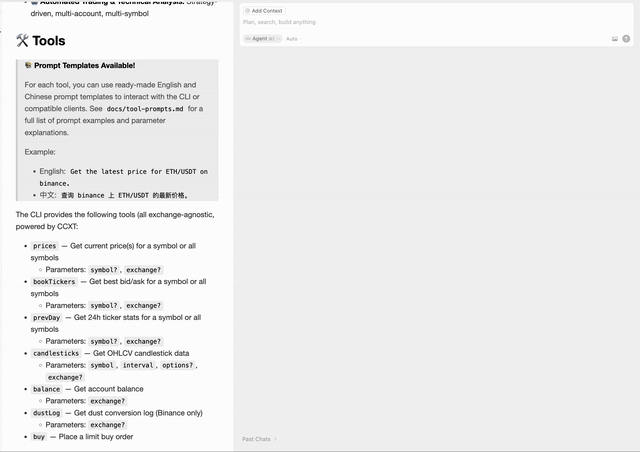

# 🚧 Crypto MCP CLI (Actively in Development!)

[](https://discord.gg/mJ8cdaJ5rg) [](https://t.me/crypto_mcp)

🇨🇳 **中文用户请查看[中文文档](./docs/README.zh-CN.md)**

> ⚠️ **This project is under active development! Features, APIs, and documentation are rapidly evolving. Feedback and contributions are welcome.**

A powerful MCP for cryptocurrency market data, cross-platform trading, arbitrage, kline (candlestick) analysis, portfolio analysis, and more. **Supports multi-exchange, multi-account, and advanced multi-strategy analytics (MACD, Bollinger Bands, KDJ, EMA, etc.)**. Built on CCXT for robust exchange integration.

## ✨ Features

-   🏦 **Multi-Exchange:** Trade and analyze on all major certified exchanges CCXT powered)
-   🔄 **Arbitrage:** Cross-exchange arbitrage and analytics
-   📈 **Kline/Candlestick Analysis:** Advanced OHLCV and indicator analytics (MACD, Bollinger Bands, KDJ, EMA, and more)
-   📊 **Portfolio & Position Analysis:** Unified multi-exchange portfolio view
-   🤖 **Automated Trading & Technical Analysis:** Strategy-driven, multi-account, multi-symbol

## 🛠️ Tools



> 📚 **Prompt Templates Available!**
>
> For each tool, you can use ready-made English and Chinese prompt templates to interact with the CLI or compatible clients. See [`docs/tool-prompts.md`](./docs/tool-prompts.md) for a full list of prompt examples and parameter explanations.
>
> Example:
>
> -   English: `Get the latest price for ETH/USDT on binance.`
> -   中文: `查询 binance 上 ETH/USDT 的最新价格。`

The CLI provides the following tools (all exchange-agnostic, powered by CCXT:

-   `prices` — Get current price(s) for a symbol or all symbols
    -   Parameters: `symbol?`, `exchange?`
-   `bookTickers` — Get best bid/ask for a symbol or all symbols
    -   Parameters: `symbol?`, `exchange?`
-   `prevDay` — Get 24h ticker stats for a symbol or all symbols
    -   Parameters: `symbol?`, `exchange?`
-   `candlesticks` — Get OHLCV candlestick data
    -   Parameters: `symbol`, `interval`, `options?`, `exchange?`
-   `balance` — Get account balance
    -   Parameters: `exchange?`
-   `dustLog` — Get dust conversion log (Binance only)
    -   Parameters: `exchange?`
-   `buy` — Place a limit buy order
    -   Parameters: `symbol`, `quantity`, `price`, `options?`, `exchange?`
-   `sell` — Place a limit sell order
    -   Parameters: `symbol`, `quantity`, `price`, `options?`, `exchange?`
-   `marketBuy` — Place a market buy order
    -   Parameters: `symbol`, `quantity`, `options?`, `exchange?`
-   `marketSell` — Place a market sell order
    -   Parameters: `symbol`, `quantity`, `options?`, `exchange?`
-   `orderStatus` — Get order status
    -   Parameters: `symbol`, `orderId`, `exchange?`
-   `allOrders` — Get all orders for a symbol
    -   Parameters: `symbol`, `exchange?`
-   `openOrders` — Get open orders for a symbol
    -   Parameters: `symbol`, `exchange?`
-   `cancel` — Cancel an order
    -   Parameters: `symbol`, `orderId`, `exchange?`
-   `cancelAll` — Cancel all open orders for a symbol
    -   Parameters: `symbol`, `exchange?`
-   `trades` — Get recent trades for a symbol
    -   Parameters: `symbol`, `exchange?`
-   `checkExchangeConfigs` — Check all supported exchanges for API key/secret config
    -   No parameters
-   `analyzeLogs` — Analyze system logs
    -   Parameters: `date?`, `search?`, `limit?`

## 🚀 Getting Started

**If you find this project useful, please [star⭐️ us on GitHub](https://github.com/rosendolu/crypto-mcp-server)! Your support helps us grow and improve.**

### Usage

#### 1️⃣ Get Your Exchange API Key & Secret

To use the MCP server, you need API credentials from your exchange account (e.g., Binance, Gate, etc.).

If you don't have an account yet:

> Don't have an account? Click to sign up now

[ Binance](https://www.marketwebb.net/activity/referral-entry/CPA?ref=CPA_00568KAJ11)  
 [ Gate](https://www.gateweb.space/signup/AVFAVws?ref_type=103)

After registering, create an API key and secret in your exchange account dashboard.

> To place an order, write permission is required.

#### 2️⃣ Add the MCP Tool

The CLI can be used directly with an MCP-compatible client, such as **Cursor**, **Claude**, that supports stdio transport:

[](https://cursor.com/install-mcp?name=Crypto%20MCP%20Server&config=eyJjb21tYW5kIjoibnB4IC15IGNyeXB0by1tY3Atc2VydmVyIiwiZW52Ijp7IkJJTkFOQ0VfQVBJX0tFWSI6IiIsIkJJTkFOQ0VfU0VDUkVUIjoiIiwiR0FURV9BUElfS0VZIjoiIiwiR0FURV9TRUNSRVQiOiIifX0%3D)

```json
{
    "Crypto MCP Server": {
        "command": "npx",
        "args": ["-y", "crypto-mcp-server"],
        "env": {
            "BINANCE_API_KEY": "",
            "BINANCE_SECRET": "",
            "GATE_API_KEY": "",
            "GATE_SECRET": ""
        }
    }
}
```

### Environment Variables

```
# Example for Binance
BINANCE_API_KEY=your_binance_api_key
BINANCE_SECRET=your_binance_secret

# Example for OKX
OKX_API_KEY=your_okx_api_key
OKX_SECRET=your_okx_secret

# Example for Gate
GATE_API_KEY=your_gate_api_key
GATE_SECRET=your_gate_secret

# ...repeat for each supported exchange below
```

#### Supported Exchanges (CCXT Certified)

-   binance
-   binancecoinm
-   binanceusdm
-   bingx
-   bitget
-   bitmart
-   bitmex
-   bybit
-   coinex
-   cryptocom
-   gate
-   hashkey
-   htx
-   hyperliquid
-   kucoin
-   kucoinfutures
-   mexc
-   modetrade
-   okx
-   woo
-   woofipro

For each exchange above, set `${EXCHANGE_ID}_API_KEY` and `${EXCHANGE_ID}_SECRET` in your `.env` file. You may configure multiple exchanges at once; the system will use the one you specify at runtime or default to the first valid configuration found.

#### Logger Configuration (optional)

```
LOG_LEVEL=info # options: emerg, alert, crit, error, warning, notice, info, debug
```

#### Multi-Exchange & Multi-Strategy Support

-   The system supports all CCXT certified exchanges for both public and private endpoints.
-   At least one exchange's API Key/Secret must be configured for the system to start.
-   You can switch the active exchange via configuration or parameters in your application code.
-   If no valid API credentials are found for any supported exchange, the system will throw an error and log the issue.
-   **Multiple technical indicators and strategies supported:** MACD, Bollinger Bands, KDJ, EMA, and more.

## 🤝 Business Cooperation

We are actively seeking business partners and collaborators! If you are interested in exploring commercial cooperation, integration, or joint ventures with the Crypto MCP project, we would love to hear from you. Please contact us at rosendofun@gmail.com to discuss potential opportunities.

## License

Licensed under the Apache License, Version 2.0;
Copyright (c) 2025 Rosendo.
